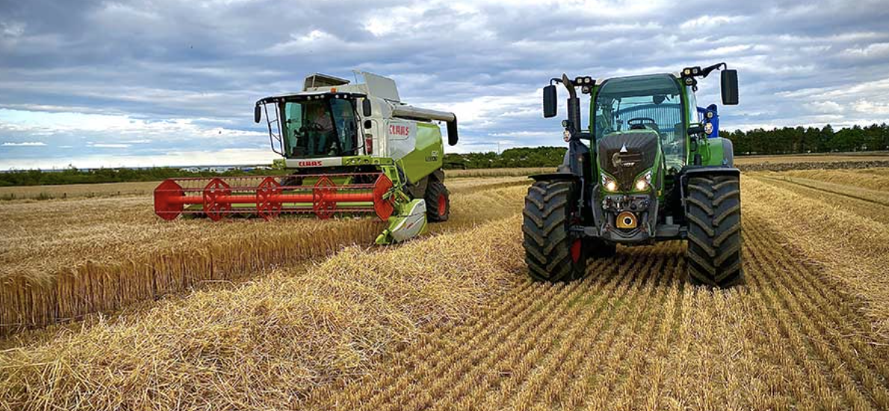
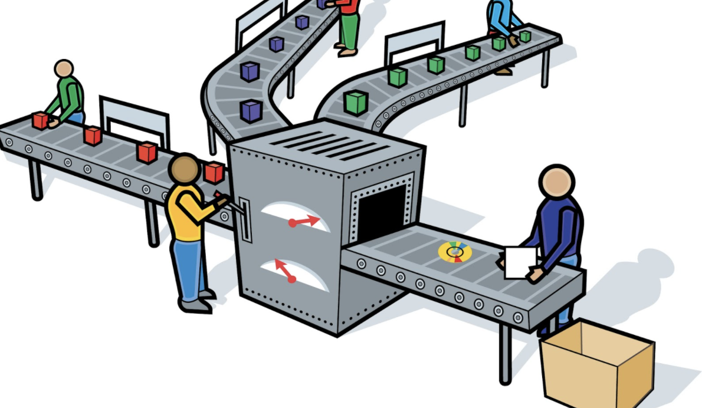
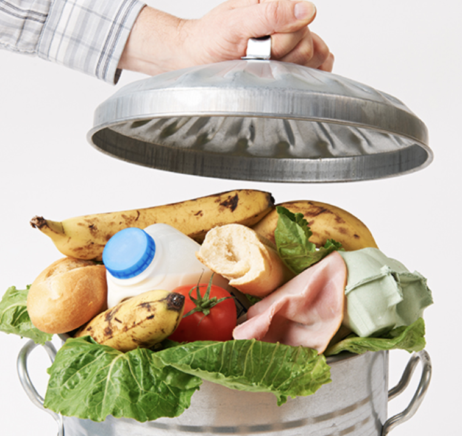
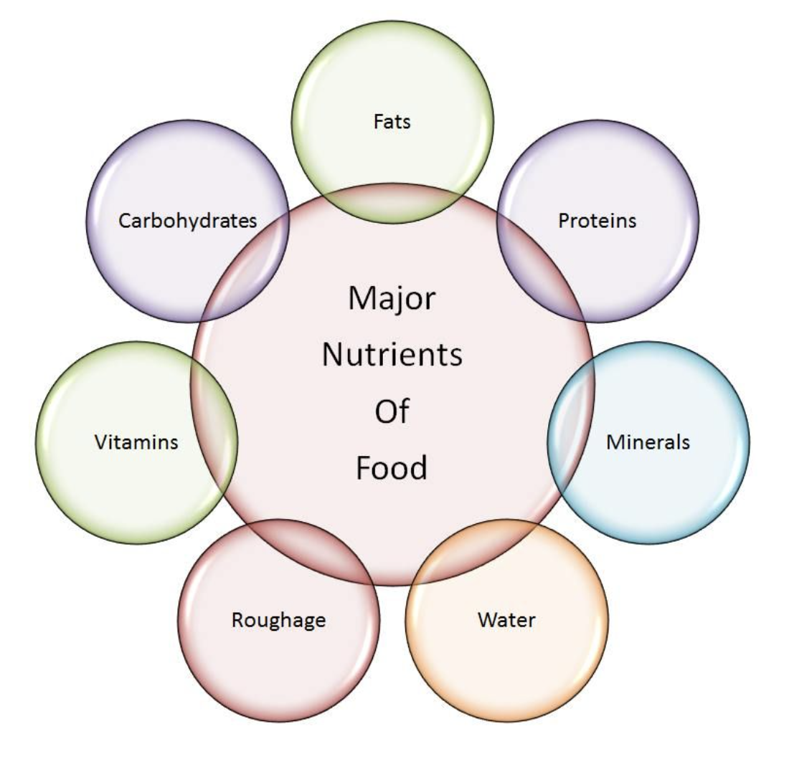

devtools::install_github("yihui/xaringan")
```{r setup, include=FALSE}
options(htmltools.dir.version = FALSE)
library(dplyr)
library(tidyr)
library(ggplot2)
library(tidyverse)
```

background-image: url(http://www.pptbackgrounds.org/uploads/http--wallpapers-free-review-net-wallpapers-16-snoopy-dog-jpg-backgrounds-wallpapers.jpg)
background-size: cover
# Outline

- Background

- Objectives

- Dataset description

- Results 
    + Refused food component
    + Unit adjustment of nutrition amount
    + Interactive graphics
    + Potential recyclable nutrition (case study)
- Conclusion 

- Reference

---

#Background --- Food Wastes

Food wastes: 30 to 40% of the food supply. About 20% of meat is wasted.  


**Harvest**     **Transportation**    


**Production**  **Consumption**      

---

## Background --- Main Nutrient Components

 

---
background-image: url(http://www.pptbackgrounds.org/uploads/http--wallpapers-free-review-net-wallpapers-16-snoopy-dog-jpg-backgrounds-wallpapers.jpg)
background-size: cover

## Objective

The **overall objective** of this project is to look for a higher amount of discarded/non-edible food components in meat with a higher amount of beneficial nutrients, in order to provide a research idea to extract nutrients from recycled food components to decrease food waste.     
The **specific objectives** are:  

1. Looking for potential recyclable food components.   

2. Adjusting units for nutrient amount, and calculating the exact     
amount of each nutrient grouped by food component. 

3. Exploring potential recyclable food components with    
higher nutrient amount.
    + Total nutrient amount
    + Weighted nutrient amount
   
4. Case Study --- Vitamin E

---
background-image: url(http://www.pptbackgrounds.org/uploads/http--wallpapers-free-review-net-wallpapers-16-snoopy-dog-jpg-backgrounds-wallpapers.jpg)
background-size: cover
## Dataset description

Lin
```{r echo = F, message=F, warning=F}
food_component <- read.csv("datasets/food_component.csv")
food_nutrient <- read.csv("datasets/food_nutrient.csv")
nutrient <- read.csv("datasets/nutrient.csv")
food_component_nutrient <- inner_join(food_component,food_nutrient,by = "fdc_id") # This results in 6300 observations of 18 variables
food_component_nutrient <- inner_join(food_component_nutrient, nutrient, by= c("nutrient_id"="id") ) # add the nutrient name instead of nutrient id
food_dataset <- food_component_nutrient[,c(3,4,5,6,11,14,15,16,19,20)] # the "food nutrient of food component" analysis
col_names <- c("component_name","pct_weight","is_refuse","gram_weight","nutrient_amount","min","max","median","nutrient_name","nutrient_unit")
colnames(food_dataset) <- col_names
food_dataset <- food_dataset[,c(1,2,3,4,9,5,6,7,8,10)]
food_dataset <- food_dataset %>% mutate(nutrition_amount_in_component= nutrient_amount/100*(gram_weight/pct_weight))  
```

---
## Result - Refused food component

Lin

```{r message = F, warning = F, out.width="0.5\\textwidth", out.height="0.5\\textwidth", fig.align="center"}
ggplot(food_dataset)+ geom_bar (aes(x= is_refuse, fill =component_name, weight = nutrition_amount_in_component))
```

---
## Result - Adjust units of nutrition amount

Lin

```{r message = F, warning = F, out.width="0.5\\textwidth", out.height="0.5\\textwidth", fig.align="center"}
food_dataset <- food_dataset %>% filter(is_refuse == 'Y') %>% group_by (nutrient_name)
ggplot(food_dataset)+ geom_bar(aes(x= component_name, fill =component_name, weight = nutrition_amount_in_component)) + coord_flip() + facet_wrap(~nutrient_unit)
```

---
## Result - Interactive graphics

The clear data visualization is carried out via [shiny applet---interactive graphics](https://lzhao.shinyapps.io/nutrition/)   

The food component **Separable Lean** contains the highest amount for all nutrients, due to it exists in many food wastes, therefore, it is a very valuable recycling food component that we will explore later for nutrient extraction and utilize.   

Why **interactive graphics** ?     
   
 

---
## Result - Potential recyclable refuse

Lin
---
background-image: url(http://www.pptbackgrounds.org/uploads/http--wallpapers-free-review-net-wallpapers-16-snoopy-dog-jpg-backgrounds-wallpapers.jpg)
background-size: cover
## Conclusion


---
background-image: url(http://www.pptbackgrounds.org/uploads/http--wallpapers-free-review-net-wallpapers-16-snoopy-dog-jpg-backgrounds-wallpapers.jpg)
background-size: cover
## References


---
background-image: url(http://www.pptbackgrounds.org/uploads/animal-friendship-backgrounds-wallpapers.jpg)
background-size: cover
class: inverse, center, middle

# Thank You!


